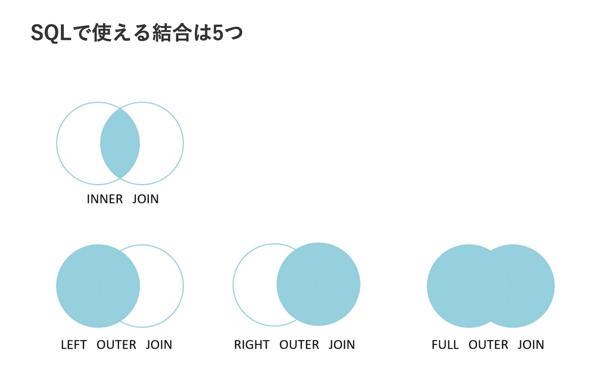

# sql_jointの概念図

## 実際のコード
`SELECT * FROM table1 INNER JOIN table2 ON table1.id = table2.id;`

一致した部分だけ

`SELECT * FROM table1 LEFT OUTER JOIN table2 ON table1.id = table2.id;`

`SELECT * FROM table1 FULL OUTER JOIN table2 ON table1.id = table2.id;`

全てを合体させる(nullの可能性)

`SELECT * FROM table1 CROSS JOIN table2 ;`

全ての組み合わせ

## 応用

`SELECT * FROM 表1 INNER JOIN 表2 ON ( 条件1 AND 条件2 );`